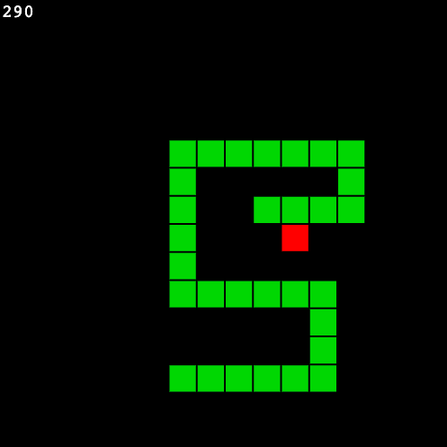

# SimpleSnakeGame
This is a JavaScript Version of the Game 'Snake'. The goal for this project was to create an easily accesible version of the game using JavaScript. Accordingly all code 
is contained in a single HTML file, which emulates the game on a single HTML - Canvas Element. Embedding the game into more complex websites or applications is therefore 
easily achievable.

### Installation

No additional files are needed. Simply clone the repository or copy the 'snake.html' file from the root of this project. The 'snake.html' file can be opened by a 
browser of your choice. Since the project is build only using basic HTML elements and JavaScript, any modern browser should suffice.

###

